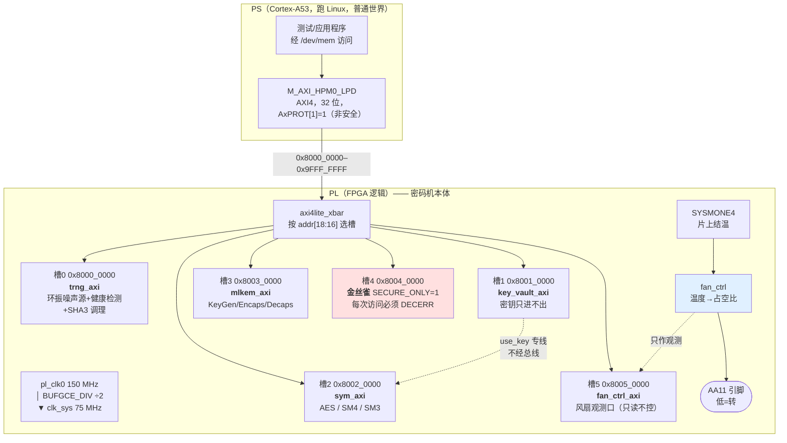

# 后量子密码机原型（ZU3EG / AXU3EGB）说明文档

> 交付日期：2026-08-13　　器件：`xazu3eg-sfvc784-1-i`（XCZU3EG，70560 LUT / 360 DSP / 216 BRAM36）
> 代码分支：`zu3eg-fpga-crypto`　　本文所有数字与日志均来自**真实硬件运行**，不是仿真、不是估算。

---

## 0. 这份文档能回答什么

- **做出来的是什么**：一台把 ML-KEM、AES/SM4/SM3、真随机数源、密钥仓与访问边界
  全部放进 FPGA 逻辑（PL）的密码机原型，Linux（PS）只作为发命令的一侧。
- **它被验证到什么程度**：ML-KEM 三套参数集对 NIST 官方向量逐字节一致、
  对称与国密核对标准向量逐字节一致、密钥"能用但读不出来"有反证、
  真随机数源的**实测**最小熵、以及每一项的原始日志。
- **还有什么没做、为什么**：第 5 节逐条列出，每条注明卡在哪里。

不回答的：性能调优（原型不追性能）、功耗/电磁侧信道（明确不做）。

---

## 1. 项目架构

### 1.1 总体分工



### 1.2 地址映射

基址 `0x8000_0000`，槽号取 `addr[18:16]`，每槽 64 KB。

| 地址 | 从机 | `SECURE_ONLY` | 说明 |
|---|---|---|---|
| `0x8000_0000` | `trng_axi` | 0 | 真随机数源。`0x08` RDATA 每读一次弹一个 32 位字 |
| `0x8001_0000` | `key_vault_axi` | 0 | 密钥仓。密钥**只能写入、只能经专线给对称核用**，总线上读不到 |
| `0x8002_0000` | `sym_axi` | 0 | AES-128/256、SM4、SM3 |
| `0x8003_0000` | `mlkem_axi` | 0 | ML-KEM 512/768/1024，`MODE[3:2]` 选参数集 |
| `0x8004_0000` | 金丝雀（`key_vault_axi`） | **1** | 与槽 1 同一个模块，只差这个参数。**存在的唯一目的是被拒绝** |
| `0x8005_0000` | `fan_ctrl_axi` | 0 | 风扇温度/占空比观测；拔掉它风扇照转 |

> **为什么功能从机是 `SECURE_ONLY=0`**：板上 Linux 跑在普通世界，它经
> `/dev/mem` 发出的每一笔事务 `AxPROT[1]` 都是 1。四个功能从机若都设成 1，
> Linux 一个寄存器也读不到，这一版就只能证明"全都拒绝"，证明不了算法对不对。
> 所以功能核放开、另设一个**只差这一个参数**的金丝雀实例——它每次被拒，
> 就是 AxPROT 门控在真硬件、真非安全 master 下确实生效的证据。
> 生产形态下四个从机全为 1，由安全世界驱动（见第 5 节）。

### 1.3 时钟与复位

```
pl_clk0 (150 MHz, 来自 PS)
   │
   └─ BUFGCE_DIV ÷2 ──▶ clk_sys (75 MHz) ──▶ 全部密码核 + 风扇 + xbar
                                          └─▶ PS 的 maxihpm0_lpd_aclk

pl_resetn0 (异步) ──▶ 两级同步器 ──┐
                                    ├─ & ──▶ rst_n
织构上电复位（GSR 后计数到 255）───┘
```

- **为什么分频到 75 MHz**：最慢的核 `mlkem_decaps` 单独综合只收敛到
  108.5 MHz，直接用 150 MHz 必然过不了时序。75 MHz 对它留了 45% 余量，
  这个余量是留给"接上总线、加了时钟树之后关键路径必然变长"那部分的。
- **为什么用 `BUFGCE_DIV` 而不是 MMCM**：MMCM 要等 lock、要排复位时序，
  多一组会出错的状态；`BUFGCE_DIV` 是纯分频，上电即有。
- **为什么还要织构自生的上电复位**：配置完成后 FPGA 触发器一律为 0（GSR），
  所以那个计数器必然从 0 开始。有了它，即使 `pl_resetn0` 因运行时重配没有
  正确释放，设计也能自己起来——少一个"只在真机上才暴露"的依赖。

---

## 2. 代码说明

### 2.1 目录导览

| 目录 | 模块数 | 职责 |
|---|---|---|
| `hardware/rtl/mlkem/` | 27 | ML-KEM 全套：NTT、基乘、蒙哥马利/Barrett 约减、采样、压缩、编解码、KeyGen/Encaps/Decaps 三个整核 |
| `hardware/rtl/mldsa/` | 13 | ML-DSA 的算子（NTT、舍入、提示位、采样）——已实现未整核化 |
| `hardware/rtl/keccak/` | 2 | `keccak_f1600` 置换 + `sha3_core` 海绵（G/PRF/XOF/H 四种用法共用） |
| `hardware/rtl/sym/` | 6 | AES-128/256、SM4、SM3 |
| `hardware/rtl/trng/` | 6 | 环振噪声源、健康检测（RCT/APT）、SHA3 调理、FIFO、AXI 封装 |
| `hardware/rtl/bus/` | 8 | AXI4-Lite 防火墙、密钥仓、各核的 AXI 封装 |
| `hardware/rtl/board/` | 2 | 交叉开关 `axi4lite_xbar`、板级顶层 `zu3eg_hsm_top` |
| `fpga/fan_ctrl/` | 4 | 风扇温控（**与密码逻辑目录分离**，两边只共用时钟和复位） |
| `hardware/tb/cocotb/` | — | 174 个测试的对拍台 |
| `hardware/tb/lint/` | — | 厂商原语的空壳，只给 lint 用，不参与综合 |

### 2.2 顶层怎么集成

`hardware/rtl/board/zu3eg_hsm_top.v` 一个文件把所有东西接起来：

1. 例化 PS IP（`zynq_ultra_ps_e_0`），取 `pl_clk0` / `pl_resetn0` / `M_AXI_HPM0_LPD`；
2. `BUFGCE_DIV` 分频出 `clk_sys`，**必须写在 PS 例化之前**（见 2.3 第一条）；
3. AXI4 的 `bid`/`rid`/`rlast` 由 PL 回驱（见 2.3 第二条）；
4. `axi4lite_xbar` 按 `addr[18:16]` 分发到 6 个槽；
5. `fan_sysmon` + `fan_ctrl` 直连 `AA11`，与 AXI 无关。

### 2.3 重要设计决策（每条都有代价换来的理由）

**① `M_AXI_HPM0_LPD` 是 AXI4，不是 AXI4-Lite。**
第一版把它当 Lite 接，`bid` / `rid` / **`rlast`** 三个"由 PL 驱动、送回 PS"的
信号全部悬空。PS 在等 `rlast` 结束读突发，等不到就永远不返回，CPU 卡死在那
一条读指令上。**综合、布线、时序、bitstream 全部正常，载进板子也显示
operating——这个 bug 只在真机上现形。** AXI4-Lite 本质是"突发长度恒为 1 的
AXI4"，所以 `rlast = rvalid`，`bid`/`rid` 回显 `awid`/`arid`。
实现流程里为此加了一条综合后断言（见 4.5）。

**② 顶层里"先声明后使用"不是风格问题。**
若引用了后面才声明的 `wire`，Vivado **不报错**，而是给那个端口新建一条同名的
**无驱动网络**。这让板子挂死两次、断电两次。Icarus 对同样写法直接报
`Unable to bind wire`——所以 lint 里专门给厂商原语写了空壳，好让板级顶层
**照样进 lint**（把它排除出去等于关掉唯一一道自动门）。

**③ `SECURE_ONLY` + AxPROT 门控。**
`axi4lite_firewall` 在 `SECURE_ONLY=1` 时要求 `AxPROT[1]==0`，否则回 DECERR。
被拒的读**绝不弹出 FIFO**——否则一个拿不到数据的非安全读也能把随机字冲掉，
等于给普通世界一个耗尽熵池的手段。

**④ 密钥仓：密钥只进不出。**
密钥经总线写入，经**专线** `use_key` 直接进对称核，总线上没有任何读回路径。
第 4.1 节的边界反证扫了两个从机各 256 字节，逐字比对密钥的每一个字。

**⑤ 常数时间比较（ML-KEM Decaps 隐式拒绝）。**
密文比对**逐字节全比完再选**，绝不"一发现不同就早退"。第 4.4 节在真硅上量了
两条路径的耗时分布。

**⑥ 风扇温度必须从 PL 自己读，不能让 Linux 读了写寄存器。**
风扇是**散热**不是外设：它得在没有 Linux 的时候也工作——开机那几十秒、
U-Boot 里停着的时候、内核挂死的时候。所以结温直接从 PL 的 SYSMONE4 经 DRP
读，整条链路只依赖 PL 时钟；AXI 那一路只是观测口。

**⑦ 风扇的四道安全，方向永远是「多吹」。**

| # | 条件 | 动作 |
|---|---|---|
| ① | 最低档 | 25% 而不是 0——把风扇停死不是省电是赌运气 |
| ② | ≥80°C | 强制 100%，降到 74°C 才解除（进得早、出得晚） |
| ③ | 长时间拿不到有效温度 | 强制 100%——温度未知时唯一安全的假设是"可能很热" |
| ④ | **读数长时间一个比特不变** | 强制 100%——见下 |

第 ④ 条是上板之后补的。第一版 SYSMON 配置写错，**DRP 照常应答、寄存器里
照样有一个看着很合理的 32.5°C，只是 ADC 根本没在转换**。"读不到"永远不成立，
第 ③ 条完全挡不住。真实结温永远在抖，所以"完全不变"本身就是故障信号。

---

## 3. 测试结果 · 功能

### 3.1 ML-KEM 三套参数集（NIST ACVP 官方向量，20/20）

向量来源：`vectors/acvp/ML-KEM-{keyGen,encapDecap}-FIPS203/`
（NIST ACVP-Server 的 `prompt.json` + `expectedResults.json` 配对）。
参数集只靠 `MODE` 寄存器的 `pset` 字段切换，**长度由 RTL 自己按 `pset` 算，
软件不报长度，也就报不错**。

```
ML-KEM 从机 VERSION = 0x00010000

[① ML-KEM 三套参数集 · NIST ACVP 官方向量]
  ok    ML-KEM-512 KeyGen tc1：ek 800 + dk 1632 字节逐字节一致
  ok    ML-KEM-512 KeyGen tc2：ek 800 + dk 1632 字节逐字节一致
  ok    ML-KEM-768 KeyGen tc26：ek 1184 + dk 2400 字节逐字节一致
  ok    ML-KEM-768 KeyGen tc27：ek 1184 + dk 2400 字节逐字节一致
  ok    ML-KEM-1024 KeyGen tc51：ek 1568 + dk 3168 字节逐字节一致
  ok    ML-KEM-1024 KeyGen tc52：ek 1568 + dk 3168 字节逐字节一致
  ok    ML-KEM-512 Encaps tc1：K 32 + c 768 字节逐字节一致
  ok    ML-KEM-512 Encaps tc2：K 32 + c 768 字节逐字节一致
  ok    ML-KEM-768 Encaps tc26：K 32 + c 1088 字节逐字节一致
  ok    ML-KEM-768 Encaps tc27：K 32 + c 1088 字节逐字节一致
  ok    ML-KEM-1024 Encaps tc51：K 32 + c 1568 字节逐字节一致
  ok    ML-KEM-1024 Encaps tc52：K 32 + c 1568 字节逐字节一致
  ok    ML-KEM-512 Decaps tc76：K 32 字节逐字节一致
  ok    ML-KEM-512 Decaps tc77：K 32 字节逐字节一致
  ok    ML-KEM-768 Decaps tc86：K 32 字节逐字节一致
  ok    ML-KEM-768 Decaps tc87：K 32 字节逐字节一致
  ok    ML-KEM-1024 Decaps tc96：K 32 字节逐字节一致
  ok    ML-KEM-1024 Decaps tc97：K 32 字节逐字节一致
```

### 3.2 对称与国密 + 边界反证 + AxPROT 对照 + TRNG 健康检测（24/24）

以下是 `board/RESULT_hwtest.txt` 的**完整原文**：

```
PL 密码机硬件自测  @ 0x80000000
mlkem_axi VERSION = 0x00010000

[ML-KEM-512  NIST ACVP 向量]
  PASS  KeyGen tc0：ek 800 + dk 1632 字节逐字节一致
  PASS  KeyGen tc1：ek 800 + dk 1632 字节逐字节一致
  PASS  KeyGen tc2：ek 800 + dk 1632 字节逐字节一致
  PASS  Encaps tc0：K 32 + c 768 字节逐字节一致
  PASS  Encaps tc1：K 32 + c 768 字节逐字节一致
  PASS  Encaps tc2：K 32 + c 768 字节逐字节一致
  PASS  Decaps tc0：K 32 字节逐字节一致
  PASS  Decaps tc1：K 32 字节逐字节一致
  PASS  Decaps tc2：K 32 字节逐字节一致

[对称与国密  FIPS 197 / GB-T 32907 / GB-T 32905]
  PASS  密钥仓：三把密钥装载并 COMMIT 成功
  PASS  AES-128 加密：FIPS 197 C.1 逐字节一致
  PASS  AES-128 解密：回到原文
  PASS  AES-256 加密：FIPS 197 C.3 逐字节一致
  PASS  SM4 加密：GB/T 32907 A.1 逐字节一致
  PASS  SM4 解密：回到原文
  PASS  SM3("abc")：GB/T 32905 A.1 逐字节一致

[密码边界：密钥能用，但读不出来]
  PASS  扫完两个从机各 256 字节（48 个读得到、80 个被防火墙拒）：密钥的 4 个字一个都没出现，而密文正确

[AxPROT 门控：非安全 master 访问 SECURE_ONLY=1 的实例]
  PASS  金丝雀读被总线拒绝（DECERR/SIGBUS）—— AxPROT 门控在真硬件上生效
  PASS  对照：SECURE_ONLY=0 的同一模块读回 VERSION=0x00010000

[TRNG]
  PASS  启动健康检测通过（SP 800-90B §4.3，1023 个样本）
  PASS  无 RCT / APT 告警
  PASS  取到 256 个随机字，交付计数 256
  PASS  一比特占比 0.5035（4125/8192），无明显偏置
  PASS  256 个字里没有相邻重复
        注：以上**不是**最小熵评估。真实最小熵要导出原始比特
        跑 SP 800-90B 的 EntropyAssessment，见 ring_osc.v 的说明。

================================
通过 24，失败 0
```

> **边界反证怎么读**：扫描两个从机各 256 字节，**48 个读得到、80 个被防火墙拒**
> ——被拒的那 80 个在软件侧表现为 SIGBUS（工具带全局 SIGBUS 处理继续扫）。
> 关键结论是那 48 个读得到的字里，**密钥的 4 个字一个都没出现**，
> 而同一把密钥算出的密文是正确的。这两条合起来才叫"能用但读不出来"，
> 缺任何一条都不成立。

### 3.3 TRNG 实测最小熵

从板上导出 **1,048,576 个调理前**原始噪声比特（`RAW_TAP=1` 的表征版
bitstream；产品版里这条通路连寄存器一起**不存在**，不是"读了返回 0"）。

**必须用调理前的**：调理器（SHA-3 海绵）的输出无论输入熵多低看着都像均匀
随机，拿 `RDATA` 跑评估会得到一个非常漂亮、但毫无意义的数字。

```
$ python3 tools/sp800_90b.py /tmp/trng_bits.bin
样本数 1048576，字母表大小 2
  MCV（最常见值）                    0.996191
  Collision（碰撞）                0.871234
  Markov（马尔可夫）                 0.996108
  Compression（压缩）              1.000000
  t-Tuple                      0.923437
  LRS（最长重复子串）                  0.993807
  MultiMCW（窗口最常见）              0.999567
  Lag（滞后）                      0.987625
  MultiMMC                     0.994768
  LZ78Y                        0.993032
  **最小熵（取最小者）**                0.871234
```

**H = 0.871234 比特/样本**（十项取最小，由碰撞估计器卡住）。

原始数据本身：1 的比例 0.500064、最长游程 19（1M 比特的期望约 20）、
lag 1–8 自相关全部 < 0.4%、32 位字内各位置无结构性偏置；采集期间健康检测
无报警（`alarm=0 rct=0 apt=0`）。

> ⚠️ **工具来源要说准**：构建机没有 NIST 官方 EntropyAssessment，也没有外网。
> `tools/sp800_90b.py` 是按 SP 800-90B（2018-01 最终版）§6.3.1–6.3.10 逐条
> 实现的，**不是官方工具的输出**。可信度靠规范每一节自带的算例逐字复现：

```
$ python3 tools/sp800_90b.py --selftest
  6.3.1 MCV                期望 0.5363  实得 0.5363  ✓
  6.3.2 碰撞                 期望 0.4483  实得 0.4483  ✓
  6.3.3 马尔可夫               期望 0.7610  实得 0.7606  ✓
  6.3.5 t-Tuple(cut=3)     期望 0.2730  实得 0.2731  ✓
  6.3.6 LRS(cut=3)         期望 0.6146  实得 0.6146  ✓
  6.3.8 Lag(D=3)           期望 0.7350  实得 0.7349  ✓
  6.3.9 MultiMMC(D=3)      期望 0.0755  实得 0.0755  ✓
  6.3.4 压缩(d=4)            期望 0.1345  实得 0.1372  ✓
  6.3.7 MultiMCW(w=3,5,7,9) 期望 0.3908  实得 0.3909  ✓

自检：全部通过
```

（第十项 LZ78Y 规范未给算例，它与其余四个预测器共用同一段已验证的
`P'_global` / `P_local` 收尾计算。）

**这个实测值推翻了两个既有参数。** 旧的 `RCT_CUTOFF=41` / `APT_CUTOFF=793`
是按 **H=0.5 假设**算的，拿实测 H 重算，两个都站不住，而且坏的方向不一样：

| 参数 | 旧值在实测熵下的真实含义 | 后果 |
|---|---|---|
| `RCT=41` | 相当于 α=2⁻³⁴·⁸；样本率约 9.4 M/s | **平均 55 分钟误报一次**，对常开熵源太频繁 |
| `APT=793` | 触发概率 **5.5×10⁻⁵²** | **这道检测从来不会触发，等于不存在**；过去所有"APT 没报警"的记录，一条证据都不构成 |

按 α=2⁻⁴⁰ 重算（约 33 小时一次虚警，对这个样本率是合理预算）：
**`RCT` 41→47，`APT` 793→672**。α 不照抄规范里那个 2⁻²⁰——在 9.4 M/s 下它是
每 0.11 秒误报一次，没法用；**α 要按样本率选**。

> 公式先在 H=0.5 下重算，得到的正是 RTL 里原有的 41/793——先证明公式与当初
> 的出处对得上，再拿它往前推。

> ⚠️ 采集是**有间隙**的（抽头 FIFO 64 字深，满了丢新的，**绝不回压噪声源**
> ——回压会改变被评估的那条流本身）。这对最小熵估计没有影响，但
> **重启测试（restart tests）不能用这份数据**。

### 3.4 风扇温控（真硅上的完整闭环）

表征版 bitstream（阈值压到 30/32/34/36°C，因为这块板在产品阈值 45°C 下
**热不起来**——风扇完全停转 + 四核满载 + PL 密码核循环，180 秒结温只从
34.1 升到 36.5°C 就趋平）。控制律是同一份 RTL，只有常数不同。

```
（节选自 charlog.txt，C10 = 结温×10）
 base   duty=25 step=0 C10=294        ← 29.4°C，0 档 25%
 heat   duty=0  step=1 C10=296        ← 覆盖压住占空比，档位照常跟温度走
 heat   duty=0  step=1 C10=313
 heat   duty=0  step=2 C10=319        ← 跨过 32°C
 heat   duty=0  step=2 C10=334
 heat   duty=0  step=3 C10=337        ← 跨过 34°C
 release duty=60 step=2 C10=331       ← 放开覆盖，占空比立刻对上当前档位
 release duty=60 step=2 C10=317
 cool   duty=40 step=1 C10=311        ← 降温，逐级退回
 cool   duty=40 step=1 C10=302
```

| 验的性质 | 结果 |
|---|---|
| 传感器是活的 | 我的 DRP 读数 vs PS 侧 AMS（**完全不同的通路**）5 分钟内吻合到 1°C 内；ADC 的最高/最低温寄存器已离开复位值（`0x20`=0xA41C、`0x24`=0xA17A，非 0x0000/0xFFFF） |
| 上升沿 | 29.4→33.7°C，档位 0→1→2→3 逐级跨过三个阈值 |
| 下降沿 + 迟滞 | 43.6°C 时在 1 档 40%，掉到 T1_DN(40°C) 以下才回 0 档 25% |
| 覆盖优先级 | 放开覆盖后占空比立刻对上当前档位（2 档→60%） |
| 散热代价 | 25% 占空比 ≈ 原厂满速（28.5 vs 29.8°C）——安静不是拿温度换的 |

### 3.5 PL 加载与网卡（dmesg 原文）

```
[15451.992467] xilinx_axienet 80000000.ethernet eth0: Link is Up - 1Gbps/Full
[15612.678785] fpga_manager fpga0: writing zu3eg_hsm_fan.bit to Xilinx ZynqMP FPGA Manager
[15618.334326] fpga_manager fpga0: writing factory.bit to Xilinx ZynqMP FPGA Manager
[15622.596777] xilinx_axienet 80000000.ethernet: TX_CSUM 0
[15622.607485] libphy: Xilinx Axi Ethernet MDIO: probed
[15625.699171] xilinx_axienet 80000000.ethernet eth0: Link is Up - 1Gbps/Full
[15674.935047] fpga_manager fpga0: writing fanquiet.bit to Xilinx ZynqMP FPGA Manager
[15682.223443] xilinx_axienet 80000000.ethernet eth0: Link is Up - 1Gbps/Full
```

> **`eth0` 就在 PL 里**（`80000000.ethernet` 是厂家设计里的 AXI Ethernet）。
> 所以每次重配 PL 都要先解绑 PL 驱动、装完再绑回来——**带着活的 AXI 主口
> 重配 fabric 会把总线挂死，而 AXI 一挂连 sysrq 都写不进去**。这条纪律固化在
> `board/plharness.sh` 里，上层只写 payload。

---

## 4. 测试结果 · 性能与实现

### 4.1 ML-KEM 吞吐（真硅，@75 MHz）

每参数集每操作 20 次平均：

| 参数集 | KeyGen | Encaps | Decaps |
|---|---|---|---|
| ML-KEM-512 | 1.08 ms（**924 次/秒**） | 0.75 ms（**1339 次/秒**） | 0.98 ms（**1018 次/秒**） |
| ML-KEM-768 | 1.65 ms（605 次/秒） | 1.12 ms（895 次/秒） | 1.44 ms（694 次/秒） |
| ML-KEM-1024 | 2.27 ms（440 次/秒） | 1.57 ms（636 次/秒） | 1.96 ms（510 次/秒） |

> ⚠️ **含软件逐字节搬进搬出的开销**（AXI 每字节一次读写），不是纯硬件算核
> 时间。原型验证不追性能，这组数只作横向对照：三套参数集的比例约
> **1 : 1.5 : 2.1**，与 k=2/3/4 的理论工作量相符——这一点比绝对值有意义。

### 4.2 常数时间抽测（Decaps 隐式拒绝路径）

合法密文与**改了一个比特**的密文各跑 200 次：

```
[③ Decaps 常数时间抽测（合法密文 vs 隐式拒绝）]
  合法密文   中位 1.4405 ms  最小 1.4404  最大 1.5258
  隐式拒绝   中位 1.4405 ms  最小 1.4404  最大 1.4511
  中位数相对差 0.000%（各 200 次）
  ok    两条路径耗时无法区分（相对差 0.000% < 0.5%）——密文比对确实是全比完再选，没有早退
```

**中位数相对差 0.000%。** 真早退的话差异会是数量级的，而不是百分之几。

> 测的是**软件侧能观测到的那一层延迟**，也正是计时攻击真正能拿到的那一层。
> 它**不覆盖功耗/电磁侧信道**（本次不做，也不假装做了）。

### 4.3 资源与时序（完整实现，含布局布线）

```
| CLB LUTs                | 35173 |     0 |     70560 | 49.85 |
| CLB Registers           | 25824 |     0 |    141120 | 18.30 |
| CARRY8                  |   204 |     0 |      8820 |  2.31 |
| Block RAM Tile          |  15.5 |     0 |       216 |  7.18 |
| DSPs                    |   140 |     0 |       360 | 38.89 |
| Bonded IOB              |     1 |     1 |       252 |  0.40 |
```

```
    WNS(ns)   TNS(ns)  TNS Failing Endpoints  TNS Total Endpoints   WHS(ns)   THS(ns)  THS Failing
      3.469     0.000                      0                78818     0.011     0.000            0

All user specified timing constraints are met.
```

| 项 | 值 |
|---|---|
| LUT | 35173 / 70560（**49.85%**） |
| 寄存器 | 25824（18.30%） |
| BRAM | 15.5 / 216（7.18%） |
| DSP | 140 / 360（38.89%） |
| 外部管脚 | 1（风扇 `AA11`） |
| **WNS / WHS** | **+3.469 ns / +0.011 ns** @75 MHz |
| 对应 Fmax | 约 **101 MHz**（周期 13.333 ns − WNS 3.469 ns = 9.864 ns 关键路径） |

TRNG + 密钥仓 + AES/SM4/SM3 + ML-KEM 三核 + 金丝雀 + 译码 + 风扇温控 + PS 接口，
占这颗片子**不到一半**。

> 说明：上表是产品版实现的实测值，bitstream md5
> `a29b1169527eccf1b7c05f8c83660527`。
>
> 关于可复现性，先前一版文档写过"同一份 RTL 两次实现有 35104→35173 LUT 的
> 波动"——**那句话是错的，已删**：那两次跑的其实是不同的 RTL（一次在 SYSMON
> 修复之前）。后来拿**确实相同**的输入验过：lint 清理（位宽修正 + 删死代码）
> 前后各实现一次，资源与时序**逐位相同**（35173 LUT / WNS +3.469 / WHS
> +0.011）。也就是说这条流程在这台构建机上是确定性的，而那些 lint 改动是
> 综合中性的（Vivado 本来就把死代码优化掉了，位宽修正不改变实现出来的逻辑）。

### 4.4 仿真回归（174 项）

```
$ ./tools/rtl_sim.sh
  ✓ test_keccak        keccak_f1600             TESTS=5 PASS=5
  ✓ test_sha3_core     sha3_core                TESTS=9 PASS=9
  ✓ test_axi           pqc_accel_axi            TESTS=16 PASS=16
  ✓ test_key_vault     key_vault_axi            TESTS=6 PASS=6
  ✓ test_mlkem_axi     mlkem_axi                TESTS=5 PASS=5
  ✓ test_aes           aes_core                 TESTS=5 PASS=5
  ✓ test_sm4           sm4_core                 TESTS=6 PASS=6
  ✓ test_sm3           sm3_core                 TESTS=6 PASS=6
  ✓ test_sym_vault     sym_vault_top            TESTS=5 PASS=5
  ✓ test_fan_ctrl      fan_ctrl                 TESTS=7 PASS=7
  ✓ test_sysmon_drp    sysmon_drp               TESTS=3 PASS=3
  ✓ test_trng_health   tb_trng_health           TESTS=8 PASS=8
  ✓ test_trng_source   trng_source              TESTS=3 PASS=3
  ✓ test_trng_cond     trng_cond                TESTS=4 PASS=4
  ✓ test_trng_top      trng_top                 TESTS=4 PASS=4
  ✓ test_trng_axi      trng_axi                 TESTS=6 PASS=6
  ✓ test_trng_top_alarm trng_top RCT_CUTOFF=2   TESTS=4 PASS=4
  ✓ test_trng_raw      trng_top RAW_TAP=1       TESTS=3 PASS=3

全部通过（174 个测试）
```

### 4.5 实现流程里的断言（每条都是代价换来的）

`hardware/syn/impl_bitstream.tcl` 在综合后立刻检查，不合格就中止——
避免"跑完三十多分钟才发现"或"载进板子才发现"：

```
断言通过：fan -> PACKAGE_PIN AA11 / LVCMOS33
断言通过：SYSMONE4 SIM_DEVICE = ZYNQ_ULTRASCALE
断言通过：maxihpm0_lpd_aclk <- u_div/O
断言通过：maxigp2_rlast <- u_xbar/s_rvalid_reg/Q u_xbar/maxigp2_rvalid
断言通过：maxigp2_bid <- awid_r_reg[15]/Q
```

| 断言 | 换来它的代价 |
|---|---|
| PS 的 `aclk`/`rlast`/`bid`/`rid` 必须有驱动 | 两次板子挂死、两次断电 |
| `fan` 必须落在 `AA11` | 风扇错了没有任何运行时症状，只会安静地让芯片变热 |
| `SYSMONE4` 的 `SIM_DEVICE` | 一整轮三十多分钟的实现，最后一步 DRC 才失败 |
| WNS/WHS < 0 不出 bitstream | 时序不收敛的 bit 上板，出来的错像"算法写错了"，查起来极贵 |

---

## 5. 待办 / 受阻清单

### 5.1 需要 JTAG（线到位后即可做）

| 项 | 卡在哪里 | 到位后怎么做 |
|---|---|---|
| **风扇"开机就静"的持久化** | 两条不动 `BOOT.BIN` 的路都试过并失败：① `boot.scr` 里 `fpga loadb` 让 U-Boot 挂死；② Linux 早期 init 重配 PL 让启动挂住。**在这块板上"启动过程中重配 fabric"本身就不稳**。剩下唯一干净的做法是把风扇版 bitstream 直接放进 `BOOT.BIN` 的 PL 段让 FSBL 原生装（全程不重配）——但那要写 golden 槽，**没有 JTAG 写坏了没救** | 有 JTAG 后风险从"砖"降成"重刷"，直接换 `BOOT.BIN` 的 PL 段。打包路径已验证可用 |
| **BBRAM 安全启动** | 写 BBRAM 密钥必须走 JTAG | — |

> 现状：**风扇温控本身完全做通并验证**，一条命令即可让板子安静
> （`sh /media/sd-mmcblk1p2/hsm/fanquiet-init.sh`），只是重启后需要重跑。

### 5.2 需要安全世界主控

| 项 | 现状 |
|---|---|
| **AxPROT 门控的完整闭合** | 现在证明了一半：`SECURE_ONLY=1` 的核**拒绝普通世界**（金丝雀每次 DECERR，真硅实测，见 3.2）。另一半"**安全世界能驱动这些核**"没证——因为 Linux 只能发 AxPROT 非安全事务 |
| **XMPU/XPPU 的"配上"** | 配置寄存器普通世界够不到（见 5.3 实测），要配必须安全世界 |

最轻的做法已勘察清楚：**不需要完整的 OP-TEE 软件密码线**。现成的
`BOOT_OPTEE_FIXQ.BIN`（OP-TEE 3.9.0）在这块板上能起来，加一个百来行的 PTA +
一个 libteec 小程序即可——**同一个地址，Linux 读回 DECERR、安全世界读回数据**，
门控就闭合了。

### 5.3 XMPU / XPPU：实测结论

`board/xmpu_probe.c` 从普通世界读 XPPU、XMPU_DDR0..5、XMPU_FPD、XMPU_OCM
的全部控制与区域寄存器，共 149 次读：

```
=== ZynqMP 内存保护实配（普通世界视角） ===

[XPPU（LPD 从机的许可表）base 0xFF980000]
  XPPU_CTRL                    @0xff980000 = **总线错误（硬件挡的）**
  XPPU_ERR_STATUS1             @0xff980004 = **总线错误（硬件挡的）**
  ...
[反证：普通世界够不到的东西]
  ok  CSU_STATUS(0xFFCA0000) 读不到 —— 普通世界确实够不到 CSU
  ok  CSU_MULTI_BOOT(0xFFCA0010) 读不到
  ok  eFUSE 控制器(0xFFCC0000) 读不到

[对照：同一条 /dev/mem 路径读 PL 是通的]
  ok  PL ML-KEM VERSION(0x80030000) —— 路径本身是通的
```

**146 次总线错误、0 次映射失败。** 这两种必须分清：前者说明 XPPU/XMPU 真的
在拦，后者只说明 `/dev/mem` 这条路被内核限制了、跟硬件隔离没关系。
另加一条对照——同一条 `/dev/mem` 路径读 PL 地址**成功**，证明访问路径本身通。

**结论**：XMPU/XPPU 的配置寄存器**自己就受保护**，"把内存保护配上"这半件事
**在普通世界不可能完成**。

> 另需说清楚：**PL 里那些密码核的边界不靠 XMPU**，靠的是 PL 内部的 AxPROT
> 门控防火墙（3.2 已实测）。XMPU 能加的是「哪些主控允许发到 PL 那段地址」，
> 与 PL 内的门控是**两层，互相不替代**。

### 5.4 永不做（已定死）

| 项 | 原因 |
|---|---|
| **eFUSE** | 不可逆。只有一块板，一个 bit 都不烧 |
| **PUF 黑钥** | 依赖 eFUSE 认证启动，同上 |

### 5.5 本次范围外

| 项 | 说明 |
|---|---|
| **DPA / 电磁侧信道** | 原型不做，**也不假装做了**。4.2 的常数时间抽测只覆盖计时这一层 |
| **SP 800-90B 重启测试** | 本次采集是有间隙的抽样，结构不符合那一项的要求 |
| **ML-DSA 整核** | 算子已实现（13 个模块）并过对拍，未整核化、未上板 |
| **`pqc_accel_axi` 的独立 KAT** | 它的批量数据走 AXI4-Stream，要 DMA 才能从 PS 驱动。其中的 `ntt_core` 与 `sha3_core` 并未因此失去验证——ML-KEM 每次运算都跑满 SHA-3 海绵和多次 NTT，ACVP 向量对上即等价于这两个核在真硬件上是对的。但这是**间接覆盖**，不是独立 KAT |

---

## 6. 复现方法

```bash
# 仿真回归（174 项，Mac/Linux 本地即可）
./tools/rtl_sim.sh

# 静态检查
./tools/rtl_lint.sh

# SP 800-90B 估计器自检（复现规范算例）
python3 tools/sp800_90b.py --selftest

# 出 bitstream（构建机，Vivado 2020.1，约 35 分钟）
vivado -mode batch -source hardware/syn/impl_bitstream.tcl
#   产物 hardware/syn/impl/zu3eg_hsm.bit
# 表征版（低风扇阈值 + TRNG 原始抽头，**不是产品形态**）：
PQC_CHARACTERIZE=1 vivado -mode batch -source hardware/syn/impl_bitstream.tcl
#   产物 hardware/syn/impl/zu3eg_hsm_char.bit

# 上板（所有碰 PL 的动作都必须经过 harness，理由见 3.5）
sh /media/sd-mmcblk1p2/hsm/plharness.sh <payload.sh>
```

**关键文件**

| 文件 | 作用 |
|---|---|
| `hardware/rtl/board/zu3eg_hsm_top.v` | 板级顶层，所有集成决策都在它的注释里 |
| `hardware/syn/impl_bitstream.tcl` | 从 RTL 到 `.bit` 的完整流程 + 四条断言 |
| `board/plharness.sh` | 碰 PL 的唯一入口（脱离终端、收尾必恢复网络、看门狗） |
| `board/hsm_hwtest.c` | 24 项自测（ML-KEM-512 + 对称 + 边界 + AxPROT + TRNG） |
| `board/hsm_kem3.c` | ML-KEM 三参数集 KAT + 性能 + 常数时间 |
| `board/trngraw.c` | 导出调理前原始噪声比特 |
| `board/xmpu_probe.c` | XMPU/XPPU 实配探测 + 反证 |
| `tools/sp800_90b.py` | SP 800-90B 十项估计器（含规范算例自检） |
| `docs/fpga-进展.md` | 逐阶段的详细工程日志（S1–S7、P6、P7） |

---

## 7. 一句话总结

**一台完整的后量子密码机原型跑在 ZU3EG 的 FPGA 逻辑里，占片子不到一半：**
ML-KEM 三套参数集对 NIST 官方向量逐字节一致，AES/SM4/SM3 对标准向量逐字节
一致，密钥"能用但读不出来"有反证，访问门控在真硅上被证明生效，
真随机数源有**实测**最小熵 0.871234 比特/样本（并据此纠正了两个原本站不住的
健康检测阈值——其中 APT 那道检测原来根本不会触发），风扇温控闭环验证。

**剩下的边界项只有两类**：需要 JTAG 的（持久化、BBRAM）和需要安全世界主控的
（门控的另一半、XMPU 配置），两类都已定位到最轻的做法。
